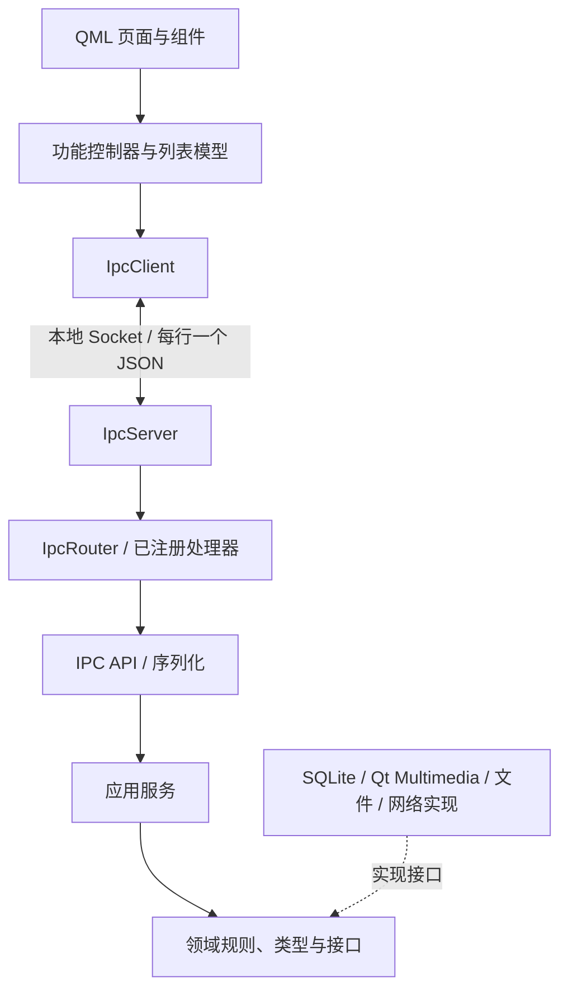

# NekoTune 架构与扩展开发

本文说明当前源码的职责、依赖和扩展约定。构建与使用见 [README](../README.md)，协议字段和方法见 [API 文档](API.md)。

NekoTune 使用分层模块化架构：QML 展示界面，前端 C++ 控制器拥有功能状态，应用服务组织业务，领域类型与接口隔离存储、播放和网络实现。后端服务由构造函数显式注入，装配集中在 `BackendSession`；内置功能采用编译期模块注册，用户扩展通过独立 Node.js 进程和动态 QML 注册接入。

## 1. 运行方式与启动入口

| 可执行文件 | 入口 | 运行方式 |
| --- | --- | --- |
| `nekotune` | `frontend/qt-qml/src/main.cpp` | GUI 主线程运行前端，`BackendRuntime` 在专用线程启动后端 |
| `nekotune-backend` | `backend/main.cpp` | 无界面进程，通过 `BackendRuntime` 启动同一套后端 |
| `nekotune-qt-qml` | `frontend/qt-qml/src/main.cpp` | 只启动前端，通过本地 Socket 连接已有后端 |

统一程序通过 `NEKOTUNE_EMBED_BACKEND` 编译定义启用后端启动逻辑，仍使用与独立客户端相同的 IPC 链路。独立前端目标不链接后端业务库。

统一模式的启动顺序：

1. `BackendRuntime` 启动线程，在该线程内创建 `BackendSession`。
2. `BackendSession` 创建数据库会话、仓储、基础设施、应用服务和 IPC 对象，注册方法并连接事件。
3. `BackendSession::start()` 检查数据库、监听 Socket 并启动曲库扫描。
4. 前端创建 `IpcClient`、`AppControllers`、翻译器和 QML 引擎，加载 `Main.qml`。
5. 连接建立后，后端发送 `server.connected` 状态快照；各前端控制器初始化自己的状态，曲库控制器请求扫描和列表刷新。

同一 Socket 名称只允许一个后端。分离运行时前后端应共享 `NEKOTUNE_HOME` 和 `NEKOTUNE_SOCKET`，以保持配置和连接一致。

## 2. 调用链与依赖边界

下面实线表示请求调用方向，虚线表示接口实现关系：



事件沿 IPC 返回前端，由订阅该事件的控制器更新属性或模型。业务服务返回类型化数据和 `Result<T>`，JSON 转换集中在 IPC 层。

| 层 | 负责 | 依赖约束 |
| --- | --- | --- |
| `domain` | 值类型、队列、歌词解析、播放规则及仓储／后端接口 | 使用 Qt Core 和 Zlib；不依赖 JSON、SQL、网络、Multimedia 或外层代码 |
| `application` | 用例编排、事务、播放与歌词协调 | 依赖领域接口；不引入具体仓储、网络或播放器实现 |
| `storage` | SQLite 连接、迁移及仓储实现 | 实现领域仓储和事务接口 |
| `infrastructure` | 播放器、文件、网络、缓存和凭据适配 | 实现领域接口；允许需要数据库的资源管理实现依赖存储层 |
| `ipc` | 参数校验、方法注册、JSON 序列化及事件传输 | 调用应用服务，不直接操作 SQLite 或具体播放器 |
| `runtime` | 对象创建、注入、事件连接、扫描和生命周期 | 连接各层的具体实现 |
| 前端 | 界面状态、用户交互及协议消费 | 通过 `IpcClient` 访问后端 |

领域接口包含 `QObject` 信号等 Qt Core 能力。当前解耦边界围绕业务与实现建立，领域层仍使用 Qt 类型。

## 3. 源码与构建目标

```text
shared/                         # 音乐根目录、配置路径与 JSON 设置
backend/
├── domain/
│   ├── library/                # 曲库类型、文件检查与托管文件接口
│   ├── playback/               # 队列、播放模式、播放器接口与随机策略
│   └── lyrics/                 # 歌词类型、解析、来源与存储接口
├── application/
│   ├── library/                # 曲库、歌单、标签、跨集合操作与下载后导入
│   ├── playback/               # 播放引擎、队列提交与播放顺序
│   └── lyrics/                 # 歌词服务、播放协调与封面解析
├── storage/                    # SQLite 会话与歌曲、队列、歌单、标签仓储
├── infrastructure/
│   ├── library/                # 文件检查、时长读取与托管资源目录
│   ├── playback/               # Qt Multimedia 播放实现
│   ├── lyrics/                 # 网络来源、缓存、存储与配套文件
│   ├── kugou/                  # 仅旧凭据迁移和兼容密钥存储
│   ├── ai/                     # AI 设置、请求与工作线程
│   └── credentials/            # 系统密钥库与旧凭据迁移
├── ipc/
│   ├── api/                    # 方法注册、参数处理与 ApiContext
│   └── serialization/          # 领域结果与 JSON 的转换
└── runtime/                    # 服务装配、后端线程与扫描协调
frontend/qt-qml/
├── src/controllers/            # 播放、曲库、队列、歌单、歌词、扩展、AI 等
├── src/models/                 # RecordModel
├── qml/shell/                  # 导航、底栏与页面注册表
├── qml/pages/                  # 首页、曲库、歌单、扩展音源、歌词、设置、诊断页
├── qml/components/             # 可复用界面组件
├── qml/dialogs/                # 元数据和标签编辑器
├── i18n/                       # 中文、英文翻译
└── resources.qrc               # 嵌入 QML、图片与翻译资源
tests/                          # 服务、存储、协议、QML 和依赖边界验证
```

目录先按层，再按业务归组。同一业务目录的头文件和实现放在一起；共享的小型文件保留在层根目录，例如 `domain/repositories.h`、`application/transaction.h`、`application/ai_service.*` 和 `ipc/ipc_router.*`。

`CollectionService` 协调曲库、歌单与播放队列，归入 `application/library`；`CoverService` 使用歌词存储和快照，归入 `application/lyrics`。`LibraryScanner` 直接协调导入执行器和托管目录，归入 `runtime`。

构建目标进一步约束链接关系，以下列出直接依赖：

| 目标 | 主要直接依赖 |
| --- | --- |
| `nekotune_paths` | Qt Core |
| `nekotune_domain` | Qt Core、Zlib |
| `nekotune_storage` | domain、paths、Qt SQL |
| `nekotune_providers` | domain、Qt Network |
| `nekotune_infrastructure` | domain、storage、paths、Qt Network／Gui／Multimedia、QtKeychain、FFmpeg；Linux 增加 libsecret 和线程库 |
| `nekotune_application` | domain |
| `nekotune_ipc` | application、paths、Qt Network |
| `nekotune_core` | ipc、storage、providers、infrastructure；源码来自 `runtime` |
| `nekotune_frontend` | paths、Qt Core／Network |

依赖项中省略共同的 `nekotune_` 前缀。`nekotune_core` 是运行时装配库名称，源码没有额外的 `backend/core` 层。网络歌词来源与本地歌词存储共享 `infrastructure/lyrics` 目录，但分别编入 providers 和 infrastructure 目标；目录归组不等于合并构建目标。

内部包含路径从 `backend` 根开始，例如 `application/playback/player_engine.h`。新增文件加入所属 CMake 目标；需要 AUTOMOC 的接口头文件应显式登记。前端控制器和模型由 CMake 收集，QML 文件仍需加入资源清单。

## 4. 核心业务模块

### 播放与顺序

`PlayerEngine` 通过 `IPlaybackBackend` 操作媒体源、播放状态、位置、音量和音频元数据，具体实现为 `QtPlaybackBackend`。播放实现不负责曲库、下载或数据库访问。

音频设备由同一接口暴露普通设备／端口数据和输出可用性信号，Qt 类型保留在基础设施层。`AudioOutputService` 负责持久选择与默认设备／断开策略，保存回调在 `BackendSession` 注入。Linux 可选的 `PulseAudioPorts` 使用原生 libpulse 异步订阅和切换同声卡端口，通过非阻塞主循环迭代接入后端线程，并在切换后回读确认。`QtPlaybackBackend` 在设备或耳机端口丢失时停用输出，`PlayerEngine` 清除待播放意图并检查所有起播路径；前端的共享 `AudioOutputController` 通过 IPC 同步设置页和播放栏，不直接枚举本机音频设备。

`PlayerQueue` 是领域队列，歌曲 ID 与队列项 ID 分开：同一歌曲可以在队列中出现多次，每个队列项仍有独立身份。`QueueService` 恢复持久队列，并提供先写库、后更新内存的提交入口。

`PlaybackOrderService` 管理顺序、单曲循环、随机和列表循环；自动播完、手动下一首与上一首由 `PlaybackAdvance` 区分。随机策略通过 `IShuffleStrategy` 注入，默认使用 `ShuffleBagStrategy`。服务先提出选择，队列提交成功后才确认随机状态和历史，避免失败切歌推进内部顺序。播放模式通过装配处注入的保存函数写入配置。

### 曲库、歌单与标签

`LibraryService` 管理歌曲资料、路径、标签和时长；`PlaylistService`、`TagService` 提供各自的操作。`MetadataPatch` 使用可选字段表达部分更新：缺失保留，空值明确清空。

`CollectionService` 负责需要跨集合协调的用例：导入并入队、加入歌单、按列表播放、删除歌曲及其关联。仓储负责 SQL，跨仓储事务和成功后的播放调整由应用服务协调。

### 歌词与封面

后端 `LyricsController` 连接播放器和歌词线程，使用歌曲内容 hash 与递增 `revision` 过滤迟到结果。前端同名控制器只管理展示状态和请求，两者职责不同。

`LyricsService` 通过 `ILyricsStorage` 读取本地歌词和缓存，通过 `LyricsProvider` 请求候选。普通自动加载顺序为本地 KRC → 本地 LRC → 自定义歌词 → 缓存 → LRCLIB；强制刷新跳过自定义歌词和缓存，本地文件仍优先。低置信度候选交由用户选择。

LRCLIB 在后端装配处注册，扩展歌词来源随运行时动态注册。扩展歌词来源可支持歌曲版本、歌词候选、下载的分阶段选择。`SidecarStore` 保存接受的歌词和配套封面；`CoverService` 统一解析本地优先的封面，`ApiContext::withCover()` 在歌曲 JSON 中补充 `cover_url`，各界面消费同一字段。

### 外部音源与 AI

音源插件在主仓库之外维护：独立 Node 进程处理账号和网络，QML 通过扩展贡献注册页面与设置。主项目构建不读取外部音源源码，也不生成或安装它们的 ZIP。音乐下载统一由 `MusicService` 完成受限代理传输、文件检查和入库，再在写队列外调用来源的 `downloaded` 钩子保存配套资源。宿主仅保留旧凭据迁移兼容代码。旧网络适配器和音源专属回归测试也在外部项目维护；主仓库使用无网络的通用扩展夹具测试导航和设置。

`AiService` 在数据库所属线程读取歌曲与标签快照，通过 `IAiBackend` 交给独立 AI 线程。`AiBackend`／`AiSettings` 处理歌词文本、配置、凭据和网络请求，工作线程不持有数据库连接。`song.suggest_metadata` 只返回建议，不进入结构性写队列；用户保存时复用元数据事务。

## 5. 请求、事件与前端状态

### 协议与调度

`IpcServer` 使用 `QLocalServer`，按换行分帧读取 JSON；Linux 下为 Unix domain socket，访问限制为当前用户。默认连接名为 `nekotune`，`NEKOTUNE_SOCKET` 可覆盖。

这是自定义 JSON 请求／响应协议，字段形状如下，完整语义以 [API 文档](API.md) 为准：

```json
{"id":1,"method":"library.list","params":{}}
{"id":1,"status":"ok","data":{"library":{"songs":[],"tags":[]}}}
{"event":"library.changed"}
```

`IpcRouter::registerMethod()` 注册处理器并拒绝重复方法名；`dispatch()` 校验方法与参数，关联请求 ID，并保证响应完成入口只生效一次。播放、曲库、歌词、音乐来源、扩展和 AI 在独立 API 文件中注册。

需要串行的操作在注册时指定 `serialized = true`，交给 `CommandScheduler`。导入等异步操作只有实际完成入库或入队后才响应；查询、暂停、停止、跳转和音量无需等待结构性写任务。扩展中的异步服务可以返回受理结果，后续完成通过事件报告，应分别理解这两种完成语义。

客户端断连时清理等待中的请求，重连重新接收快照，不自动重放修改命令。已接受的后端任务可能在客户端断连后继续完成。

### 控制器与页面

`IpcClient` 管理连接、请求 ID、响应匹配和事件发布。`AppControllers` 装配各功能控制器；它们订阅自己的事件并向 QML 暴露属性、模型和操作。

播放位置、时长、音量、曲目和模式分别通知；`library.changed` 触发曲库刷新，进度事件不刷新曲库。`RecordModel` 按稳定 ID 插入、移动、删除或发送 `dataChanged`，避免整表重置。曲库控制器拥有搜索、标签筛选与选择，并用请求代次隔离元数据加载结果；`AiController` 同样丢弃过期建议，前端歌词控制器消费后端校验后的快照。

元数据编辑器先通过 `song.metadata` 加载完整资料，再允许保存修改字段。列表省略歌词不代表歌词为空。AI 建议只更新草稿，编辑器关闭或切换歌曲后忽略迟到结果。

`Main.qml` 装配窗口、导航、快捷键、弹窗、队列抽屉和底栏。`PageRegistry.js` 定义首页、曲库、扩展音源、歌单、正在播放、设置与诊断页；页面通过属性接收控制器、传输状态和翻译器，业务状态由控制器或页面拥有。

当前非调试页面会在启动时创建，通过可见性切换保留页面状态；诊断页由启动参数启用。页面注册目前不提供按首次访问延迟加载。

## 6. 线程与生命周期

| 执行环境 | 对象与任务 |
| --- | --- |
| GUI 主线程 | IpcClient、前端控制器、列表模型和 QML 对象 |
| 后端线程 | BackendSession、SQLite 会话、业务协调、IPC、播放器适配器和扩展进程通信对象 |
| 导入线程 | ImportExecutor 的目录遍历、SHA-256、音频时长读取 |
| 歌词线程 | LyricsService、歌词来源、解析与歌词存储 |
| AI 线程 | AI 配置、歌词输入准备及模型网络请求 |
| 凭据工作线程 | CredentialStore 串行执行系统密钥库调用 |

SQLite 连接只能在创建它的线程使用。导入线程返回 `ImportedFile` 值，资源登记、映射和入库回到后端线程；AI 线程接收值快照。跨线程通过 Qt 消息调用或信号传递结果，不共享数据库连接。

`LyricsService` 和它的 provider 子对象一起移入歌词线程，新增网络对象必须保持正确线程归属。线程退出前先取消任务和网络请求，完成等待回调，再释放对象。

当前 `BackendSession::shutdown()` 依次停止扩展进程、扫描和配套文件任务、停止接收连接、关闭命令调度、停止 AI 与导入任务、断开客户端、停止歌词任务，最后停止播放。`BackendRuntime` 在后端线程销毁 session 后才退出线程并等待结束。每个模块的关闭应可重复调用。

## 7. 持久化、托管文件与一致性

### 身份和存储

`shared/app_paths.*` 提供音乐根目录、配置路径和设置读写。默认音乐根目录为 `~/Music/NekoTune`，数据库为 `config/nekotune.sqlite3`；`NEKOTUNE_HOME` 覆盖根目录，`NEKOTUNE_DB_PATH` 可单独覆盖数据库。

歌曲使用音频 SHA-256 作为去重身份，路径可以变化或有多个。SQLite 保存歌曲、路径、歌单、标签、队列、托管资源编号、来源映射和扫描忽略记录；系统密钥库保存账号密钥、登录会话和 AI Key。

`MusicDirectory` 为资源分配递增编号。外部音频优先以绝对软链接进入编号目录，Windows 使用原生文件软链接而非 Shell 快捷方式。链接创建失败时保存版本化的 `.audio.json` 外部引用，数据库播放路径指向原音频，资源编号独立确定配套文件位置；下载音频为真实文件；程序获取的歌词和封面是编号目录中的真实配套文件，不写入外部源目录。

### 事务与删除

队列及跨集合操作遵循：

1. 校验参数并构造候选状态。
2. 通过共享 `ITransaction` 开启事务，写入仓储并提交。
3. 成功后更新内存队列、播放源或随机历史，再发送事件。

`Transaction` 未提交时自动回滚，仓储不自行嵌套开启事务。存储失败返回 `Result<T>` 错误，由 IPC 映射为 `status: error`，不能发送成功结果或采用未提交的队列。

删除歌曲会协调曲库、歌单、队列和扫描忽略状态。`clean_files: true` 时，通过 `IManagedFiles` 暂存登记的托管音频及配套文件；数据库失败则回滚暂存，数据库成功后再清理。提交后仍未删除的文件通过 `cleanup_errors` 报告。外部导入只清理软链接或经登记校验的引用文件，保留外部源文件。

API 默认不清理文件，界面删除确认框默认勾选清理；前端必须显式传递选择，不以 API 默认值推断界面行为。

### 扫描与配套资源

后端启动及前端连接会请求扫描；`LibraryScanner` 拒绝重复启动正在运行的扫描。导入线程负责发现和检查文件，扫描逐文件向命令调度器提交入库，避免整个扫描长期独占写队列。扫描也补齐旧歌曲缺失的时长，不改变队列或批量发起网络请求。

扫描支持编号音频引用，离线检查引用对应音频的 SHA-256；引用可在数据库丢失后恢复原编号，损坏引用或内容不匹配时报告错误。扫描排除配置目录和目录软链接，并尊重删除时记录的 hash；手动导入和下载可以恢复记录。在线歌词和封面的写入受当前歌曲 hash、`revision` 和离线状态约束，过期请求不能覆盖新选择。

默认目录的升级迁移保留旧数据库与缓存，已有目标数据优先。旧明文凭据或旧 libsecret 条目在新密钥库写入并回读成功后才删除，失败保留原数据。QtKeychain 明文回退关闭，凭据不会出现在状态快照或事件中。

## 8. 扩展约定

### 用户动态扩展

完整使用与开发契约见 [扩展文档](extensions.md)。`IExtensionBackend` 是领域侧的异步调用与事件边界，`ExtensionService` 和 `MusicService` 在应用层编排注册来源和业务操作。基础设施中的 `ExtensionBackend` 启动捆绑 Node 管理进程；管理进程再为每个扩展启动独立进程。两级通信都使用独立本地 Socket，日志与协议分离。普通扩展调用不会占住 `CommandScheduler`，只有短暂的数据库变更和已有文件导入流程进入串行队列。

音乐来源以来源 ID 和来源曲目 ID 保存稳定身份，`songs.hash` 对在线记录为空。`ISourceResolver` 将在线引用异步解析成宿主管理的本地代理 URL，再交给现有 Qt Multimedia 适配器；网络地址、鉴权头和有效期只存在于运行时。解析代次与播放意图隔离迟到结果。下载复用托管资源分配、文件校验与曲库入库。远程资源的歌词、封面使用独立资源键，不进行本地配套文件探测或清理。

前端 `ExtensionsController` 消费后台注册快照。`PageHost` 保留原页面，并按用户选择加载替代项；`ExtensionView` 使用独立 QML 引擎管理视图和重载生命周期。默认 Shell 仍由 `Main.qml` 组织，完整 Shell 扩展接管窗口内容。恢复窗口由宿主独立加载，并强制使用内置主题。QML 故障不能实现进程级隔离，安全模式用于重启恢复。

### 内置功能扩展

### 新增业务功能

1. 确定业务所属层，定义输入、输出和确有替换需求的接口。
2. 编写应用服务，通过构造函数注入依赖；需要持久化时实现仓储，跨仓储事务留在用例中。
3. 在独立 IPC API 文件注册方法，决定是否需要串行，并补充序列化和错误语义。
4. 在 `BackendSession` 装配服务、注册模块、连接事件，明确所有权和关闭顺序。
5. 在前端增加功能控制器或扩展已有控制器，让 QML 接收相应状态和操作。
6. 更新所属 CMake 目标、资源清单、API 文档和必要的服务／协议测试。

异步处理器必须在成功、失败和取消路径完成一次回调。影响集合的写操作使用串行调度，状态查询和只生成建议的任务保持独立。普通业务扩展应进入对应服务，不把导入、下载、账号或页面业务堆进 `PlayerEngine`、通用路由或 `Main.qml`。

### 新增歌词来源

在 `infrastructure/lyrics` 实现 `LyricsProvider` 的 `descriptor`、`request`、`cancel`，分阶段来源声明 `staged` 并实现 `choose`。通过 `completed` 发布候选，通过 `resolved` 发布文档；提供方私有 hash、凭据与下载标识保留在适配器内部，通用候选携带不透明句柄。

加入 providers 构建目标，在 `BackendSession` 的歌词装配处注册并设置父对象。`lyrics.sources` 自动暴露来源，前端据此生成菜单；新增手动来源不会自动改变默认 LRCLIB 加载策略。

### 新增页面或播放实现

页面在 `qml/pages` 中声明 `shell`、`controllers`、`transport`、`translator` 属性，按需提供导入和编辑信号。将描述加入 `PageRegistry.js`，文件加入 `resources.qrc`；页面选择和请求回调保留在功能控制器或页面中。

替换播放器时实现 `IPlaybackBackend`，在装配处替换 `QtPlaybackBackend`。扩展随机算法实现 `IShuffleStrategy` 并注入 `PlayerEngine`；新增播放模式还需同步领域枚举、顺序规则、IPC 校验、前端选项、翻译和协议文档。

## 9. 验证与当前约束

常规开发验证：

```sh
cmake -S . -B build
cmake --build build --parallel
QT_QPA_PLATFORM=offscreen QT_QUICK_BACKEND=software \
ctest --test-dir build --output-on-failure
git diff --check
```

依赖边界检查也可单独运行，无需先构建：

```sh
cmake -DSOURCE_DIR="$PWD" -P tests/dependency_boundaries.cmake
```

服务与仓储测试覆盖队列、播放顺序、歌词、曲库、封面、扩展、AI 和凭据。`nekotune_refactor_test` 使用假播放实现验证失败提交，也通过真实后端、Socket、前端控制器和 QML 验证交互；`nekotune_slider_quick_test` 执行 `tests/qml` 下的界面用例。

Linux 密钥库集成测试由 `tests/with_test_keyring.sh` 创建临时 D-Bus 会话和密钥环；缺少工具时返回 77，CTest 将其标记为跳过。网络单测使用模拟响应，不能代替真实账号、短信或付费歌曲下载验收。

需要截图时可运行：

```sh
QT_QPA_PLATFORM=offscreen QT_QUICK_BACKEND=software \
NEKOTUNE_TEST_SCREENSHOT=/tmp/nekotune.png \
./build/tests/nekotune_refactor_test realQmlMetadataSelectionAndMute
```

截图仍需查看内容。构建、CTest、QML 静态警告、交互与视觉检查、真实网络验收应分别报告。手动运行冒烟测试时使用独立的 `NEKOTUNE_HOME`、Socket 和数据库路径，并隔离 XDG 配置、数据与缓存目录。

当前实现有以下维护边界，扩展时需考虑：

- `BackendSession` 集中连接事件，`ApiContext` 共享多个服务；模块持续增加时，应按职责收窄上下文和装配代码。
- `IpcClient` 尚无通用请求超时，`CommandScheduler` 依赖任务完成回调释放队列；异步扩展需提供超时、取消和完成保障。AI 自身已有总超时。
- 曲库列表全量传输和前端筛选适合当前规模；`RecordModel` 查找与重排最坏为平方复杂度，大曲库可考虑分页与索引。
- 依赖检查通过源码包含的正则匹配发现违规，是架构约束的辅助检查，不能覆盖所有间接依赖。
- Socket 是本地接口。Web、终端或其他客户端可复用协议，但这些客户端和远程访问桥接目前需要另行实现。
